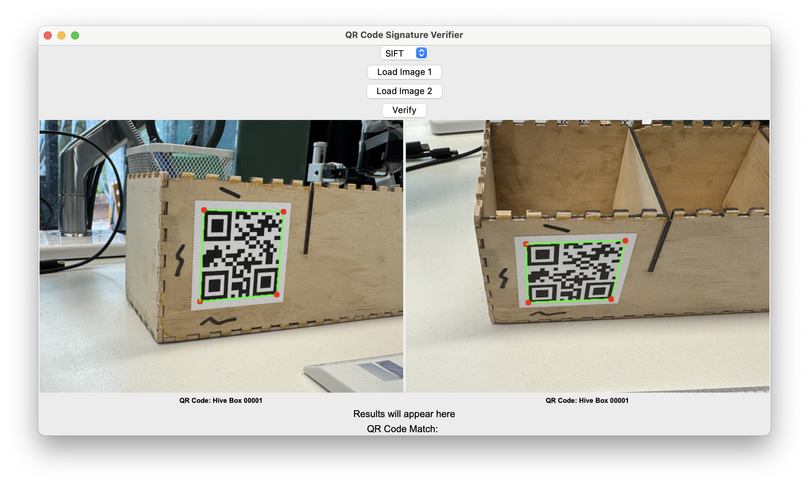

# QR Verifier

A Python-based tool for detecting and verifying QR codes using OpenCV and SIFT-based and ORB-based texture analysis.

## Features

- Detects QR codes from images
- Extracts and rectifies the QR region
- Analyses surrounding texture for authenticity scoring (future feature)
- Visualises similarity results

## Screenshots

Below are screenshots illustrating the step-by-step use of the QR Code Signature Verifier GUI.

1. **Initial State**  
   

2. **Images Loaded with QR Detected**  
   

3. **Matching Result with Feature Lines for SIFT and ORB** 
    
   

## Installation

First, create a virtual environment and activate it (optional but recommended):

```bash
python -m venv venv
source venv/bin/activate  # On Windows use `venv\Scripts\activate`
```

Then install the dependencies:

```bash
pip install -r requirements.txt
```

### Installing `pyzbar`

`pyzbar` is a wrapper for the ZBar library. You must install ZBar on your system separately.

- **macOS**:

  ```bash
  brew install zbar
  ```

- **Ubuntu/Debian**:

  ```bash
  sudo apt-get install libzbar0
  ```

- **Windows**:  
  ZBar is bundled with `pyzbar` for Windows, but if you encounter issues, consult the [pyzbar GitHub repository](https://github.com/NaturalHistoryMuseum/pyzbar).

### Troubleshooting

If you receive an error like:

```
ImportError: Unable to find zbar shared library
```

This typically means that `pyzbar` is installed, but your system can't locate the underlying ZBar shared library.

#### macOS Fix

If you're on macOS and ZBar is already installed via Homebrew, try running your script with this command:

```bash
DYLD_LIBRARY_PATH=$(brew --prefix zbar)/lib python QR_verifier.py path/to/your/image.jpg
```

If that works, add the following to your `~/.zshrc` (or `~/.bash_profile`):

```bash
export DYLD_LIBRARY_PATH=$(brew --prefix zbar)/lib:$DYLD_LIBRARY_PATH
```

Then reload your terminal config:

```bash
source ~/.zshrc
```

Finally, rerun your script:

```bash
python QR_verifier.py
```

This ensures your system can properly link to the ZBar shared library.

## Usage

To run the QR Verifier tool, use the script with an image path as a command-line argument:

```bash
python QR_verifier.py
```

The script will:

- Open the GUI for selecting two images
- Detect QR codes in the selected images
- Compare the QR codes using SIFT-based and ORB-based texture analysis
- Display the similarity score

## License

MIT License
